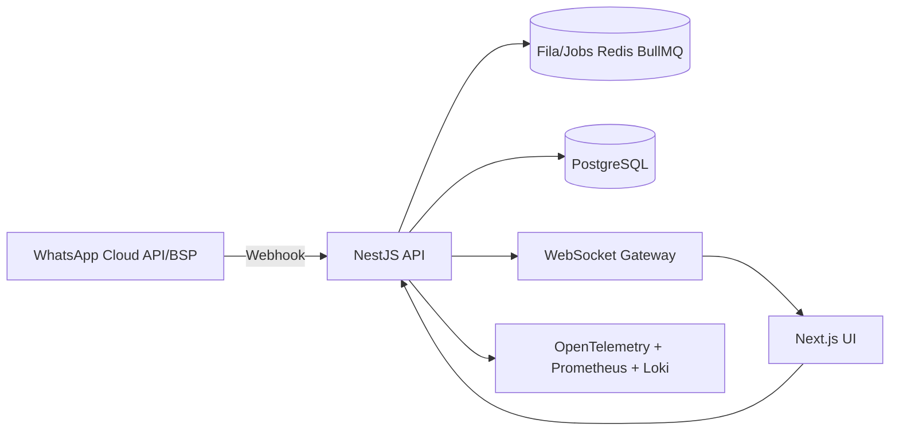

# Arquitetura de Referencia (MVP)

## Componentes
- Frontend `Next.js + React + TypeScript`: Inbox, Pipeline Kanban, Pedidos, Relatorios.
- Backend `NestJS`: API REST, processamento webhook idempotente, realtime via Socket.IO.
- Banco `PostgreSQL`: fonte de verdade transacional.
- Cache/Fila `Redis`: base para automacoes, retries e tarefas assincronas.
- Integracao WhatsApp desacoplada por porta/adaptador (`WhatsappProviderPort`).

## Fluxos Criticos MVP
- Receber webhook -> deduplicar por `webhook_events(source, external_event_id)` -> salvar mensagem -> atualizar conversa -> emitir realtime.
- Enviar mensagem -> adapter WhatsApp -> persistir status inicial -> reconciliar status por webhook.
- Mover deal no pipeline -> historico de etapa -> auditoria.
- Criar pedido a partir do chat -> itens + totalizacao -> auditoria.
- Relatorios basicos: vendas do mes e SLA de 1a resposta.

## Escalabilidade
- Multi-tenant/multi-numero: entidade `whatsapp_accounts` e particionamento logico por conta.
- Concorrencia atendentes: lock leve por conversa (fase seguinte: `conversation_locks` com TTL Redis).
- Busca: PostgreSQL FTS no MVP, OpenSearch na fase de crescimento.
